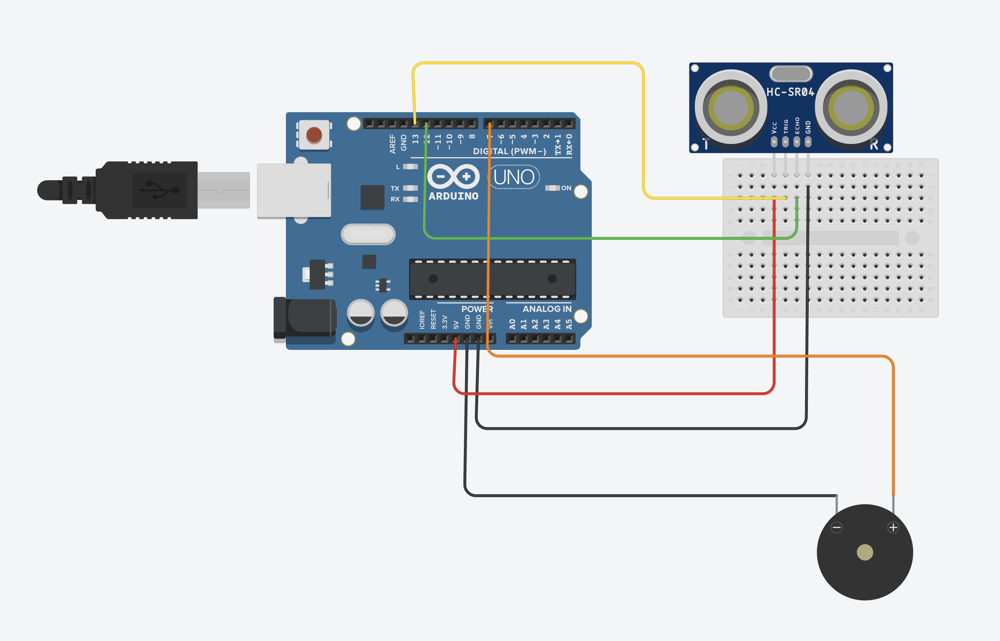

# Smart Walking Stick
Imagine you need assitance walking and are visually impaired. Many elderly people face a similar problem when they try to walk, and regardless where they are, they have an extreme risk of collision with another individual or object. This project, the _Smart Walking Stick_ ,solves that problem, by implementing haptic feedback and ultrasonic sensors to alert the user, all in one everyday walking stick.
You should comment out all portions of your portfolio that you have not completed yet, as well as any instructions:
```HTML 
<!--- This is an HTML comment in Markdown -->
<!--- Anything between these symbols will not render on the published site -->
```

| **Engineer** | **School** | **Area of Interest** | **Grade** |
|:--:|:--:|:--:|:--:|
| Ayan R. | Sacred Heart Schools Atherton| Electrical Engineering | Rising 7th Grader

**Replace the BlueStamp logo below with an image of yourself and your completed project. Follow the guide [here](https://tomcam.github.io/least-github-pages/adding-images-github-pages-site.html) if you need help.**


  
# Final Milestone

**Don't forget to replace the text below with the embedding for your milestone video. Go to Youtube, click Share -> Embed, and copy and paste the code to replace what's below.**

<iframe width="560" height="315" src="https://www.youtube.com/embed/F7M7imOVGug" title="YouTube video player" frameborder="0" allow="accelerometer; autoplay; clipboard-write; encrypted-media; gyroscope; picture-in-picture; web-share" allowfullscreen></iframe>

For your final milestone, explain the outcome of your project. Key details to include are:
- What you've accomplished since your previous milestone
- What your biggest challenges and triumphs were at BSE
- A summary of key topics you learned about
- What you hope to learn in the future after everything you've learned at BSE


# Second Milestone

**Don't forget to replace the text below with the embedding for your milestone video. Go to Youtube, click Share -> Embed, and copy and paste the code to replace what's below.**

<iframe width="560" height="315" src="https://www.youtube.com/embed/y3VAmNlER5Y" title="YouTube video player" frameborder="0" allow="accelerometer; autoplay; clipboard-write; encrypted-media; gyroscope; picture-in-picture; web-share" allowfullscreen></iframe>

For your second milestone, explain what you've worked on since your previous milestone. You can highlight:
- Technical details of what you've accomplished and how they contribute to the final goal
- What has been surprising about the project so far
- Previous challenges you faced that you overcame
- What needs to be completed before your final milestone 

# First Milestone

**Don't forget to replace the text below with the embedding for your milestone video. Go to Youtube, click Share -> Embed, and copy and paste the code to replace what's below.**

<iframe width="560" height="315" src="https://www.youtube.com/embed/CaCazFBhYKs" title="YouTube video player" frameborder="0" allow="accelerometer; autoplay; clipboard-write; encrypted-media; gyroscope; picture-in-picture; web-share" allowfullscreen></iframe>

For your first milestone, describe what your project is and how you plan to build it. You can include:
For my first milestone I coded an active buzzer and an ultrasonic sensor such that when the ultrasonic sensor senses an object within range, the buzzer beeps, alerting the user that an object is in front of them. I also made it so that as an object moves closer to the ultrasonic sensor, the intensity of the beeping increases and as the object moves further away,
- An explanation about the different components of your project and how they will all integrate together
- Technical progress you've made so far
- Challenges you're facing and solving in your future milestones
- What your plan is to complete your project

# Starter Project

**Don't forget to replace the text below with the embedding for your milestone video. Go to Youtube, click Share -> Embed, and copy and paste the code to replace what's below.**

<iframe width="560" height="315" src="https://www.youtube.com/embed/pGypySyE4-o?si=uV5eLYcMAq4hEjHF" title="YouTube video player" frameborder="0" allow="accelerometer; autoplay; clipboard-write; encrypted-media; gyroscope; picture-in-picture; web-share" referrerpolicy="strict-origin-when-cross-origin" allowfullscreen></iframe>

For my starter project, I created and RGB Slider that changes its color when you move the slider. To build this, I soldered 3 sliders, an RGB LED, and a USB-C Port onto a premade RGB Slider board. The board already had connections in it so once I finished soldering, the device was completely functional. When building this, I faced many difficulties. The biggest challenge I faced was when the device didn't work. Later, I figured out that a special USB-C plug was required for it to work. For my next step, I plan to test compatibility between an ultrasonic sensor and a buzzer.


# Schematics 

# Code
```c++
#define trigPin 12  
#define echoPin 13   
#define motorPin1 9  
#define motorPin2 10 
#define buzzer 6     

void setup() {
  pinMode(trigPin, OUTPUT);
  pinMode(echoPin, INPUT);
  pinMode(motorPin1, OUTPUT);
  pinMode(motorPin2, OUTPUT);
  pinMode(buzzer, OUTPUT);
  Serial.begin(9600);
  
  
  delay(600);
}

void loop() {
  long duration, distance;
  
  digitalWrite(trigPin, LOW);
  delayMicroseconds(2);
  digitalWrite(trigPin, HIGH);
  delayMicroseconds(10);
  digitalWrite(trigPin, LOW);
  
  duration = pulseIn(echoPin, HIGH);
  distance = (duration / 2) / 29.1;
  
  if (distance < 100) { 
    Serial.print("OBSTACLE at ");
    Serial.print(distance);
    Serial.println("cm");
    
    int beepInterval;
    if (distance < 10) {
      beepInterval = 50;   
    } else if (distance < 20) {
      beepInterval = 150;  
    } else if (distance < 40) {
      beepInterval = 300;  
    } else if (distance < 60) {
      beepInterval = 500;  // 
    } else {
      beepInterval = 800;  
    }
    
    
    tone(buzzer, 2000, 100); 
    delay(100);
    noTone(buzzer);
    delay(beepInterval);
    
    if (distance < 30) {
      digitalWrite(motorPin1, HIGH);
      digitalWrite(motorPin2, LOW);
    } else {
      digitalWrite(motorPin1, LOW);
      digitalWrite(motorPin2, LOW);
    }
    
  } else {
    digitalWrite(motorPin1, LOW);
    digitalWrite(motorPin2, LOW);
    noTone(buzzer);
  }
  
  delay(50); 
}
```

# Bill of Materials
Here's where you'll list the parts in your project. To add more rows, just copy and paste the example rows below.
Don't forget to place the link of where to buy each component inside the quotation marks in the corresponding row after href =. Follow the guide [here]([url](https://www.markdownguide.org/extended-syntax/)) to learn how to customize this to your project needs. 

| **Part** | **Note** | **Price** | **Link** |
|:--:|:--:|:--:|:--:|
| Super Starter Kit Uno R3 Project | Used for the Arduino hardware| $44.99 | <a href="https://www.amazon.com/ELEGOO-Project-Tutorial-Controller-Projects/dp/B01D8KOZF4"> Link </a> |
| Item Name | What the item is used for | $Price | <a href="https://www.amazon.com/Arduino-A000066-ARDUINO-UNO-R3/dp/B008GRTSV6/"> Link </a> |
| Item Name | What the item is used for | $Price | <a href="https://www.amazon.com/Arduino-A000066-ARDUINO-UNO-R3/dp/B008GRTSV6/"> Link </a> |

# Other Resources/Examples
One of the best parts about Github is that you can view how other people set up their own work. Here are some past BSE portfolios that are awesome examples. You can view how they set up their portfolio, and you can view their index.md files to understand how they implemented different portfolio components.
- [Example 1](https://trashytuber.github.io/YimingJiaBlueStamp/)
- [Example 2](https://sviatil0.github.io/Sviatoslav_BSE/)
- [Example 3](https://arneshkumar.github.io/arneshbluestamp/)

To watch the BSE tutorial on how to create a portfolio, click here.
