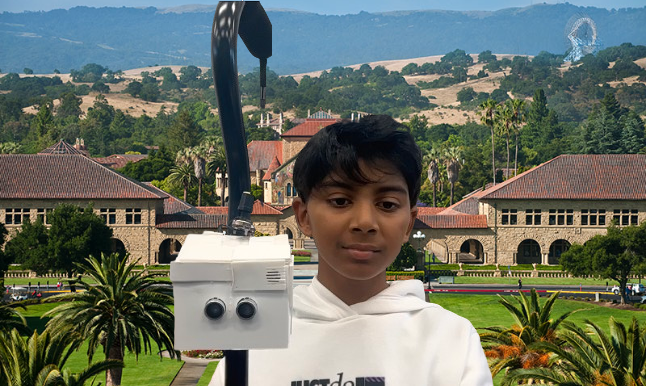
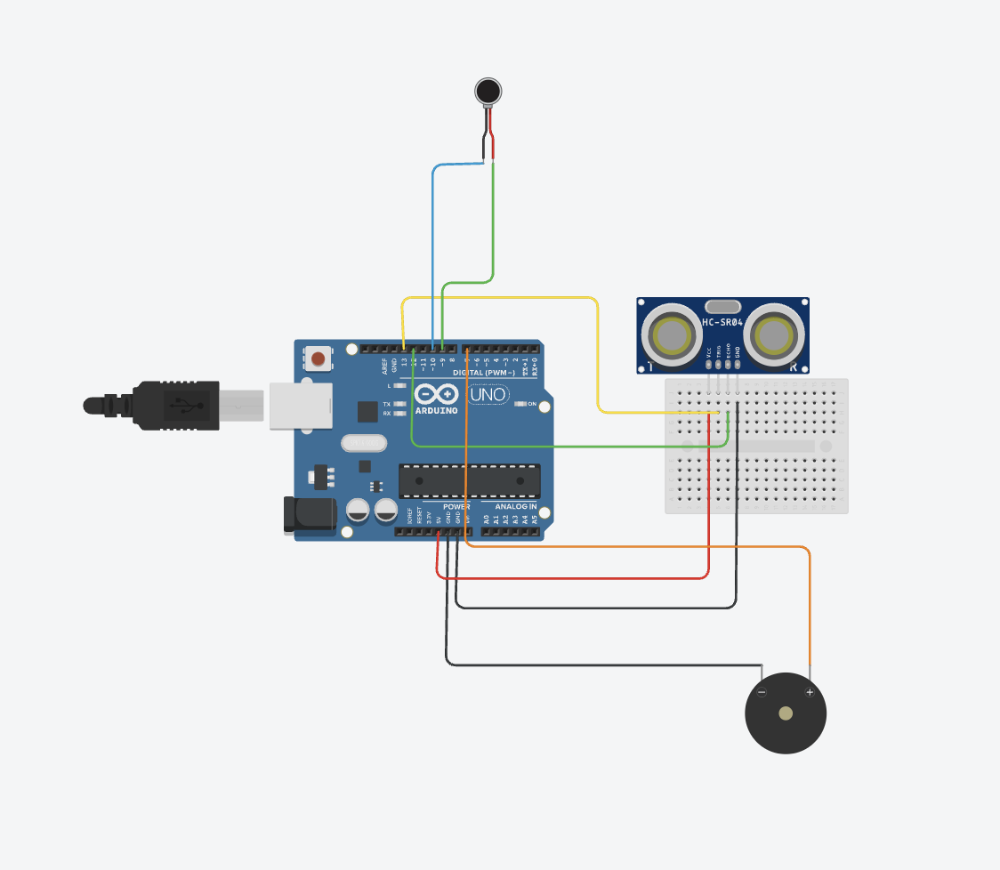
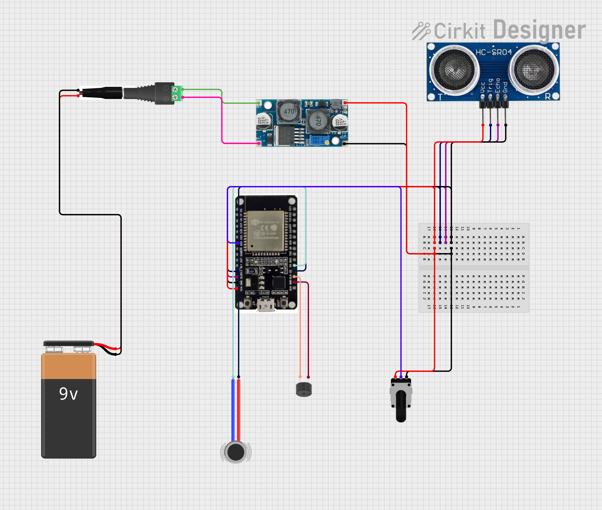

# Smart Walking Stick
Imagine you need assitance walking and are visually impaired. Many elderly people face a similar problem when they try to walk, and regardless where they are, they have an extreme risk of collision with another individual or object. This project, the _Smart Walking Stick_ ,solves that problem, by implementing haptic feedback and ultrasonic sensors to alert the user, all in one everyday walking stick.
You should comment out all portions of your portfolio that you have not completed yet, as well as any instructions:
```HTML 
<!--- This is an HTML comment in Markdown -->
<!--- Anything between these symbols will not render on the published site -->
```

| **Engineer** | **School** | **Area of Interest** | **Grade** |
|:--:|:--:|:--:|:--:|
| Ayan R. | Sacred Heart Schools Atherton| Electrical Engineering | Rising 7th Grader

**Replace the BlueStamp logo below with an image of yourself and your completed project. Follow the guide [here](https://tomcam.github.io/least-github-pages/adding-images-github-pages-site.html) if you need help.**


  
# Final Milestone

**Don't forget to replace the text below with the embedding for your milestone video. Go to Youtube, click Share -> Embed, and copy and paste the code to replace what's below.**

<iframe width="560" height="315" src="https://www.youtube.com/embed/aliZ2vpz1Oo?si=7gou4Iu0YLSY9cTK" title="YouTube video player" frameborder="0" allow="accelerometer; autoplay; clipboard-write; encrypted-media; gyroscope; picture-in-picture; web-share" referrerpolicy="strict-origin-when-cross-origin" allowfullscreen></iframe>

**Changes:**

For my final milestone, I put all of the electrical componenents into one intracately designed 3d printed box, with space for the three main modules: the ultrasonic sensor, the buzzer, and the vibrator. I then attached that box to a walking stick, hence, finishing the basic Smart Walking Stick. 

**Challenges:**

One of my biggest challenges throughout this project was integrating Bluetooth and finding a way to connect. Originally, I was planning to just add an HC05 Bluetooth module to my Arduino, but it wouldn't connect, so we switched the entire Arduino to an ESP32. Still, it didn’t connect to an iPhone, so we had to order an Android phone to make my app. My second biggest challenge was getting the measurements for my 3d prints. Although I measured with highly accurate calipers, it took me 6 tries to print just two items.

**Learnings:**
 
I learned many things at Bluestamp. Before Bluestamp, I was completely oblivious to the fact that programming something so helpful was not super hard. Through Bluestamp, I learned how to code in C language, how to assemble an Arduino circuit, what all of the pins on an Arduino and an ESP32 are meant for, and how to solder. I also learned about different laws in building a circuit, like Ohm’s Law. 

**Next Steps:**

After Bluestamp, I plan to make my project even better by sizing it down and making my app more functional by adding a feature where you can set the Max Distance through the app.


# Second Milestone

<iframe width="560" height="315" src="https://www.youtube.com/embed/Dun05Or-xW8?si=hp3TUF0y-mtD9RFD" title="YouTube video player" frameborder="0" allow="accelerometer; autoplay; clipboard-write; encrypted-media; gyroscope; picture-in-picture; web-share" referrerpolicy="strict-origin-when-cross-origin" allowfullscreen></iframe>

**Changes:**

  For my second milestone I added a vibration motor. I wired it such that when an object is detected with range of the ultrasonic sensor, the motor vibrates, which can help alert users who are hearing-impaired, when there is an object ahead. 
 
  **The Vibration Motor:**  
  
  A vibration motor works because motor has a small metal weight that looks like a half-circle or has a chunk cut out of it. When this lopsided weight spins around really fast, it creates vibrations. 

  **Schematics:**
  
  
  
  **Surprises and Challenges:**  
  
  Throughout this project, I was surprised with how easy Arduino was as I was expecting it to be significantly harder than it is. On this milestone, I faced a challenge with the vibration motor as it kept vibrating even when there was no obstacles ahead. I eventually realized it was a bug in the code. 
  
  **Next Steps:**
  
  For my final milestone, I have to put all of the electrical components together into a  box and attach that box to a walking stick I am also planning as a part of my 3rd milestone to create an app from which you can control. 
  

# First Milestone

<iframe width="560" height="315" src="https://www.youtube.com/embed/UNR_Ys4B2d8?si=_6AZb_8NVLbk55oe" title="YouTube video player" frameborder="0" allow="accelerometer; autoplay; clipboard-write; encrypted-media; gyroscope; picture-in-picture; web-share" referrerpolicy="strict-origin-when-cross-origin" allowfullscreen></iframe>

**My Project:**

  My project is the Smart Walking Stick. I am using an ultrasonic sensor, a buzzer, and a vibration motor. How my project works is when the ultrasonic sensor senses an object in front of it, it will use the piezzo buzzer and the vibration motor to alert the user by both beeping and vibrating. 

**Changes:**
  
  For my first milestone I coded an active buzzer and an ultrasonic sensor. I wired my system such that when the ultrasonic sensor senses an object within a certain range, the buzzer beeps, alerting the user that an object is in front of them. I also made it so that as an object moves closer to the ultrasonic sensor, the intensity of the beeping increases and as the object moves further away, the intensity of the beeping decreases. 

**The Ultrasonic Sensor:**

  An ultrasonic sensor works by sending ultrasonic soundwaves (sound waves with a frequency higher than the upper limit of human hearing) and measuring the time it takes for the soundwave to come back to it, calculating the distance of the nearest object. 
  
**The Active Piezzo Buzzer:**
  
  An active piezo buzzer functions by utilizing two main components, an oscillator and piezoelectric material. Piezoelectric material is special in a way such that it vibrates when it is fed electricity. The reason I was able to manipulate the beeps of the buzzer is because of the oscillator, which modifies the beeps piezo part of the buzzer sends out based on the code. 

**Schematics:**  

  
  
**Challenges:**
  
  When building this, one major challenge I faced was that I accidentally switch the 5-volt and Ground wire connecting to the ultrasonic sensor, so the Arduino wouldn't turn on. I eventually realized my mistake and fixed the problem. 
  
**Next Steps:**
  
  In the scope of my overall project, I plan to next add the vibration motor before finally assembling my walking stick and modififying it further.

# Starter Project

<iframe width="560" height="315" src="https://www.youtube.com/embed/pGypySyE4-o?si=uV5eLYcMAq4hEjHF" title="YouTube video player" frameborder="0" allow="accelerometer; autoplay; clipboard-write; encrypted-media; gyroscope; picture-in-picture; web-share" referrerpolicy="strict-origin-when-cross-origin" allowfullscreen></iframe>

For my starter project, I created and RGB Slider that changes its color when you move the slider. To build this, I soldered 3 sliders, an RGB LED, and a USB-C Port onto a premade RGB Slider board. The board already had connections in it so once I finished soldering, the device was completely functional. 

**Challenges:**

When building this, I faced many difficulties. The biggest challenge I faced was when the device didn't work. Later, I figured out that a special USB-C plug was required for it to work. For my next step, I plan to wire a basic functional system that beeps when an obstacle is detected within a set range.


# Schematics

# Code
```c++
#include <BluetoothSerial.h>
int Incoming_Value;
long duration;
float distance;
bool programEnabled = false;  // Variable to track if program is on/off
int MAX_DISTANCE = 0;

#define trigPin 12 
#define echoPin 13  
#define motorPin1 2 
#define motorPin2 4
#define buzzer 15
#define sliderPin 33
#define MIN_MAX_DISTANCE 20    // Minimum value for MAX_DISTANCE
#define MAX_MAX_DISTANCE 100   // Maximum value for MAX_DISTANCE
BluetoothSerial BLE {};

void setup() {
pinMode(trigPin, OUTPUT);
pinMode(echoPin, INPUT);
pinMode(motorPin1, OUTPUT);
pinMode(motorPin2, OUTPUT);
pinMode(buzzer, OUTPUT);
pinMode(sliderPin, INPUT);
Serial.begin(115200);
BLE.begin("Smart Walking Stick");
while (!BLE.connected())
{Serial.print("waiting for client");
}
 Serial.println("System initialized. Send '1' to turn ON, '0' to turn OFF");
delay(600);
}

void loop() {
// Check for serial input
if (BLE.available() > 0) {
  Incoming_Value = BLE.read();
  Serial.print("Receive Data");
  Serial.println(Incoming_Value);
  if (Incoming_Value == 254) {
    programEnabled = true;
    Serial.println("Program ENABLED");
  } else if (Incoming_Value == 0) {
    programEnabled = false;
    Serial.println("Program DISABLED");
    // Turn off all outputs when disabled
    digitalWrite(motorPin1, LOW);
    digitalWrite(motorPin2, LOW);
    noTone(buzzer);
  }
   else if (Incoming_Value > 0 && Incoming_Value != 254) {
      MAX_DISTANCE = Incoming_Value;
   }
  }

 // Only run the main program if enabled
if (programEnabled) {
  long duration, distance;
   // Read slider value and map it to MAX_DISTANCE range
  int average = 0;
  int sliderValue = analogRead(sliderPin);
   for (int i = 0; i < 10; i = i + 1) {
    average = average + analogRead(sliderPin);
  }
  
  average = average / 10;
    MAX_DISTANCE = map(average, 0, 1023, MIN_MAX_DISTANCE, MAX_MAX_DISTANCE);
   digitalWrite(trigPin, LOW);
  delayMicroseconds(2);
  digitalWrite(trigPin, HIGH);
  delayMicroseconds(10);
  digitalWrite(trigPin, LOW);
   duration = pulseIn(echoPin, HIGH);
  distance = (duration / 2) / 29.1;
   // Print MAX_DISTANCE and current distance
  Serial.print("MAX_DISTANCE: ");
  Serial.print(MAX_DISTANCE);
  Serial.print("cm | Current Distance: ");
  Serial.print(distance);
  Serial.println("cm");
   if (distance < MAX_DISTANCE) {
    Serial.print("OBSTACLE at ");
    Serial.print(distance);
    Serial.println("cm");
  
    //The speed of beeping changes based on distance
    int beepInterval;
    if (distance < 10) {
      beepInterval = 50;
    } else if (distance < 20) {
      beepInterval = 150;
    } else if (distance < 40) {
      beepInterval = 300;
    } else if (distance < 60) {
      beepInterval = 500;
    } else if (distance < 80) {
      beepInterval = 800;
    } else if (distance > 80) {
      digitalWrite(buzzer, LOW);
    }
  
    tone(buzzer, 2000, 100);
    delay(100);
    noTone(buzzer);
    delay(beepInterval);
  
    //Where the vibrator comes to functionality if the object is within MAX_DISTANCE
    if (distance < MAX_DISTANCE) {
      digitalWrite(motorPin1, HIGH);
      digitalWrite(motorPin2, LOW);
    } else {
      digitalWrite(motorPin1, LOW);
      digitalWrite(motorPin2, LOW);
    }
  } else {
    digitalWrite(motorPin1, LOW);
    digitalWrite(motorPin2, LOW);
    noTone(buzzer);
  }
   delay(50);
} else {
  // When disabled, just add a small delay to prevent excessive serial checking
  delay(100);
}
}

```

# Bill of Materials
Here's where you'll list the parts in your project. To add more rows, just copy and paste the example rows below.
Don't forget to place the link of where to buy each component inside the quotation marks in the corresponding row after href =. Follow the guide [here]([url](https://www.markdownguide.org/extended-syntax/)) to learn how to customize this to your project needs. 

| **Part** | **Note** | **Price** | **Link** |
|:--:|:--:|:--:|:--:|
| Super Starter Kit Uno R3 Project | Used for the Arduino hardware| $44.99 | <a href="https://www.amazon.com/ELEGOO-Project-Tutorial-Controller-Projects/dp/B01D8KOZF4"> Link </a> |
| Offset Black Cane | Used to attach the Arduino to | $10.99 | <a href="https://www.amazon.com/Medline-Aluminum-Portable-Lightweight-Injuries/dp/B0CCG17HGN?ref_=ast_sto_dp"> Link </a> |

